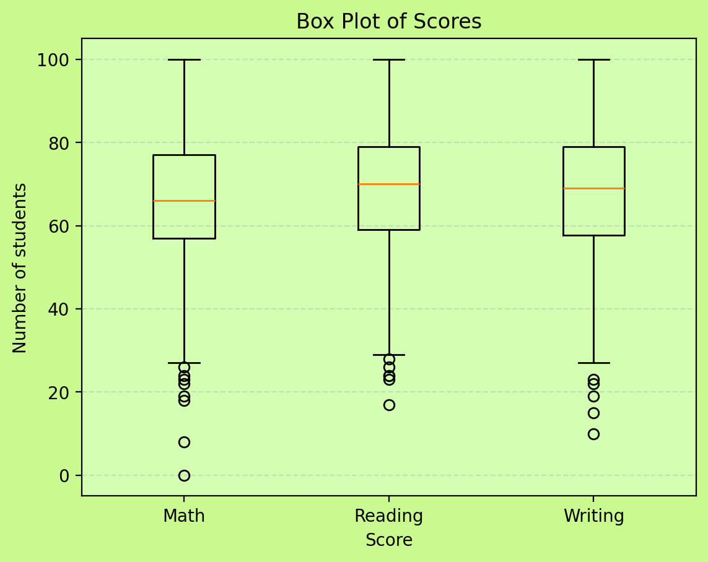

# Student Performance Dashboard

> A comprehensive data analysis and visualization dashboard that provides insights into student academic performance using Python, SQLite, and Streamlit.
>

## Live Demo
Click here to open the dashboard:
https://atharv-ac-ui-dashboard.streamlit.app/


## 📋 Overview
This project analyzes student performance data to uncover meaningful patterns and trends in academic achievement. It loads a CSV dataset into a SQLite database, runs SQL-driven analysis, and generates interactive visual reports in a Streamlit app to support data-informed decisions.

**Key Capabilities:**

- Database-driven data management with SQLite
- Statistical analysis of academic performance
- Gender-based performance comparisons
- Interactive visualizations and charts
- Quick identification of top-performing students

## ✨ Features

- **Data Management**: Load and manage student datasets in a SQLite database
- **Statistical Analysis**: Compute averages, summaries, and performance metrics via SQL queries
- **Gender Analytics**: Compare trends across gender groups
- **Visual Insights**: Distributions, box plots, and other charts for exploration
- **Top Performers**: View top-performing students based on selected metrics
- **Modular Architecture**: Organized codebase for easier maintenance and extension

## 🚀 Getting Started

### Prerequisites

Before you begin, ensure you have the following installed:

- Python 3.9+ (recommended)
- pip
- Git

### Installation

1. **Clone the repository**

```bash
git clone https://github.com/Atharv-AC/UI-Dashboards.git
cd student-performance-dashboard
```

1. **Create a virtual environment**

```bash
python -m venv venv
```

1. **Activate the virtual environment**

*Linux/macOS:*

```bash
source venv/bin/activate
```

*Windows:*

```bash
venv\Scripts\activate
```

1. **Install dependencies**

```bash
pip install -r requirements.txt
```

## 💻 Usage

To run the dashboard locally:

```bash
streamlit run dashboard.py
```

The app will:

1. Load the student dataset (from the `Dataset/` folder, unless configured differently)
2. Build or update the SQLite database
3. Compute summary statistics and KPIs
4. Render interactive charts and tables in the browser

## 📁 Project Structure

```
student-performance-dashboard/
├── Dataset/            # Input data files
├── dashboard.py        # Streamlit app entry point
├── analytics.py        # SQL queries and analysis logic
├── charts.py           # Visualization functions
├── loader.py           # CSV → SQLite loading utilities
├── db.py               # Database connection helpers
├── requirements.txt    # Python dependencies
└── README.md           # Project documentation
```

## 🛠️ Technologies Used

- **Python** — Core programming language
- **Pandas** — Data manipulation and analysis
- **Matplotlib** — Data visualization and plotting
- **SQLite** — Lightweight database management
- **Streamlit** — Interactive dashboard UI

## 📊 Output

The dashboard can generate and display:

- Average score summaries
- Gender comparison visualizations
- Distribution histograms
- Box plots for spread and outliers
- Top performers view

## 🖼️ Screenshots

### Dashboard Overview


### Gender Comparison – Math


### Gender Comparison – Reading


### Gender Comparison – Writing


### Score Distribution (Histogram)


### Box Plot of Scores



## 📚 Learning and Development Notes
- learned about streamlit.
- Practiced exploratory data analysis (EDA) and SQL-based analytics
- Improved understanding of modular Python project structure
- Learned practical data cleaning workflows in pandas
- Debugging and iteration informed improvements to the codebase


## 🤝 Contributing

Contributions are welcome. Feel free to:

- Report bugs
- Suggest new features
- Submit pull requests

## 📝 License

This project is available for educational purposes. 

## 👨‍💻 Author

**Atharv Chandurkar**

---

*For questions or support, please open an issue in the repository.*